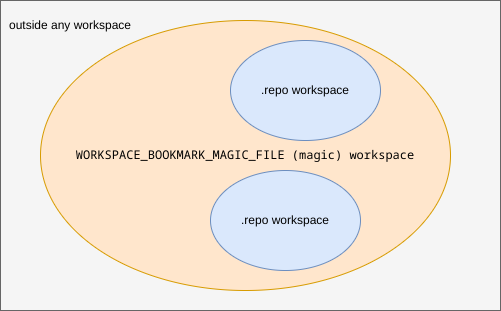

# Bookmark your .repo workspace (Android/YOCTO)

## Purpose

Provide an easier way to navigate a workspace created with repo than using `cd`.

The available tools to navigate quickly around the commands line are scripts
that set CDPATH and autojump (and z and v and fasd etc). Both are great but
their usability in specific use case can be bested.

In CDPATH if two directories contain a sub-directory of the same name the one
first in CDPATH will always be chosen. This is a no-go when frequently going to
many directories named "scripts".

Autojump is not predictable enough to make use of it in scripts. There is also
the fact that there can be multiple workspaces and autojump can jump into the
wrong one. The solution to that is to use jc but that would require one to be
in workspace root when calling it.

## Design

## Idea

### General

This tool guesses the root of a workspace by looking for .repo and than based
on it's location jumps to a bookmark that is defined as a key: value pair. The
key being the name and the value being a path relative to the workspace root.

This is predictable since a workspace only has one .repo directory. It allows
to have two or more directories of the same name but different paths to be
bookmarked and will always jump the correct directory inside the currently
used workspace regardless of where inside the workspace the caller is.


### Multiple repo workspaces in one actual workspace

In pathological cases there can be multiple .repo directories in a workspace.
For such situations you can override the default behavior and instead of
looking for '.repo' make the tool look for a custom
'WORKSPACE_BOOKMARK_MAGIC_FILE' with:

```sh
export WORKSPACE_BOOKMARK_MAGIC_FILE='.wsmagic'
```

It may happen that there is a need to switch between a typical repo workspace
and a pathological but similar looking workspace layout frequently. For example
a regular workspace layout may look like this:

```text
.
├── .repo
├── android
│   └── vendor
└── poky
    └── build
```

The pathological workspace may look like this:

```text
.
├── .wsmagic
├── case1
|   ├── .repo
│   ├── android
│   │   └── vendor
│   └── poky
│       └── build
└── case2
    ├── .repo
    ├── android
    └── poky
        └── build
```

One way to deal with this minor divergence is to introduce optional path elements.
With this the same WORKSPACE_BOOKMARKS dict may be used for the pathological and
non-pathological case.

```text
export WORKSPACE_BOOKMARKS='{
  "build": "{case2/}poky/build",
  "vendor": "{case1/}android/vendor",
  "repo": ".repo"
}'
```

Using the WORKSPACE_BOOKMARKS from above for a regular workspace we would get:

|cwd |bookmark|new cwd       |
|----|--------|--------------|
|root|build   |poky/build    |
|root|vendor  |android/vendor|
|root|repo    |.repo         |

For a pathological workspace we would get:

|cwd             |bookmark|new cwd             |
|----------------|--------|--------------------|
|root            |build   |case2/poky/build    |
|root            |vendor  |case1/android/vendor|
|case1/poky/build|repo    |case1/.repo         |

Note how in case of ambiguous locations (to .repo for example) the tool targets
the one closer to the current location is picked.

## Code

The tool is separated into two parts:

* `g` - the tool which calls cd
* `workspace_bookmarks.py` - the tool which provides an absolute path to jump to

For a workspace:

```text
outside
└── magic_ws
    ├── repo_ws_1
    │   ├── android
    │   │   └── vendor
    │   ├── poky
    │   │   └── build
    │   └── .repo
    ├── repo_ws_2
    │   ├── android
    │   ├── poky
    │   │   └── build
    │   └── .repo
    └── .wsmagic
```

The tool must understand both "current" and "target" locations which cross
.repo workspace boundaries but remain in "magic" workspace bounds.



## Usage

Things to put into your .bashrc or .zshrc:

```sh
source /path/to/setup.sh
export WORKSPACE_BOOKMARKS='{
  "build": "poky/build",
  "android": "android",
  "manifest": ".repo/manifests"
}'
```

Things to use daily:

```sh
cd some_workspace # with a .repo directory
some_workspace $ g manifest
some_workspace/.repo/manifests $ g android
some_workspace/android $ g
some_workspace $ g build
some_workspace/poky/build $ g android
some_workspace/android $ g poky/build # you can append paths relative to bookmark
some_workspace/poky/build $
```
